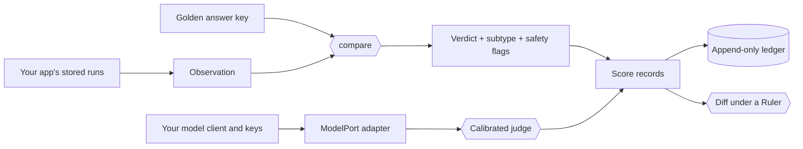

<div align="center">

# 🐤 Canary

**Catch the silent failures before your users do.**

A small, provider-neutral evaluation kernel for LLM apps and agents:
deterministic verdicts, LLM judges that must earn the right to score, and run
diffs that refuse to compare apples with oranges.

No provider SDKs, no network calls, no API keys inside — your judges run
through the model client you already trust.


[Quick start](#quick-start) ·
[Why evaluation](#why-evaluation-is-the-job-now) ·
[What's inside](#whats-in-the-box) ·
[The eval landscape](#where-canary-fits) ·
[Integration guide](docs/integration.md) ·
[Tutorial](TUTORIAL.md)

</div>

---

## Your demo passed. Your users found the bug.

LLM systems fail in two ways. **Loud failures** — timeouts, stack traces,
refusals — page someone. **Silent failures** don't. The agent returns three
contracts instead of four, ranks the results backwards, cites a record it
never read, or cheerfully runs a query it should have declined. Nothing
crashes. The dashboard stays green. The answer is wrong.

Miners once carried a canary underground because it noticed bad air before
they did. Canary does that job for AI systems. Every evaluation ends in
exactly one verdict — `correct`, `loud_fail`, or `silent_wrong` — and a silent
failure always says *which kind* of wrong it is. Every verdict comes with
receipts: the evidence behind it, the hash of the answer key it was checked
against, and the date it was scored.

## Why evaluation is the job now

Traditional software fails deterministically: the same input breaks the same
way, and one unit test pins the bug down forever. LLM systems don't work like
that. The same prompt can pass on Tuesday and fail on Wednesday. A model
upgrade can fix ten cases and quietly break three. A prompt that reads better
can score worse. When behavior is probabilistic, evaluation stops being a QA
step at the end and becomes the engineering loop itself: the spec you build
against, the regression suite that guards every release, and the early
warning system in production. Teams that ship reliable agents aren't the ones
with the cleverest prompts. They're the ones who can tell, quickly and
honestly, whether a change made things better.

That's why evaluation has become one of the busiest corners of the AI stack.
Observability platforms trace and chart every model call. Metric libraries
ship dozens of ready-made scorers. Test runners red-team prompts in CI.
Benchmark harnesses rank models on public suites. If you build with LLMs, you
probably run one of them already — and you should.

But the hardest questions in evaluation aren't about running *more* evals.
They're about trusting the ones you have:

- **Was that failure loud or silent?** A crash and a confident wrong answer
  are different risks, and a single pass rate hides the difference.
- **Can I trust the judge?** LLM-as-a-judge scales review beautifully, but an
  uncalibrated judge is just another model with opinions.
- **Did the product change, or did the ruler?** When the rubric, the judge
  model, the dataset, or the scoring code moves between runs, "+4%" might
  measure nothing at all.
- **Can I re-score last month's runs?** When the grading rules improve, old
  results should improve with them — without paying for every model call
  again.

Canary is a small, sharp library built around those four questions. It was
extracted from the evaluation code of two production AI products that had
built the same plumbing twice and watched their copies drift apart. Canary
keeps the *method* in one place; each application keeps its *instruments*:
its agents, prompts, data, model access, and storage.

## What's in the box

🎯 **A verdict taxonomy that says *how* it's wrong.** Three verdicts, four
loud-failure subtypes, and ten silent ones — `subset`, `superset`, `overlap`,
`disjoint`, `empty_wrong`, `wrong_value`, `wrong_order`, `ambiguous_shape`,
`field_conformance`, and `unexpected_execution` — plus independent safety
flags for decoy leaks, missing tenant scoping, write attempts, and truncated
results. The taxonomy is closed and versioned: a typo is a validation error,
never a new category.

🔁 **Re-score history for free.** Comparison and scoring are pure functions,
with no network, no database, and no clock. Store observations once, then
re-derive every verdict bit-for-bit whenever the rules improve.

⚖️ **Judges that must earn the right to score.** `ClosedChoiceJudge` and
`FindingsJudge` answer in a closed JSON schema and stay locked until a
calibration report shows they agree with your hand-labelled examples (by
default, 80% agreement over at least five records). Change the prompt, the
choices, or the judge's version — which should name its model — and the
calibration stops applying. A malformed answer gets one repair; a second one
is recorded as unavailable, never as a pass.

📏 **Diffs that refuse to compare apples with oranges.** A `Ruler` records the
grading standard: taxonomy version, judge rubric hashes, calibration IDs,
criteria, and frozen inputs. `diff_scores` sorts cases into improved,
regressed, mixed, unchanged, and incomparable, keeps a label-transition
matrix so "same score, different failure" still shows up, and refuses outright
when the ruler changed.

🧊 **Pre-registered experiments.** Freeze the config, corpus, source hashes,
data revision, and hypotheses *before* the run, the way a careful lab would.

🎲 **Luck versus progress.** A ⌈2n/3⌉ stability bar with sample-size
sensitivity shows when a "win" is really just n.

📒 **An append-only ledger.** Resumable JSONL checkpoints with content-hashed
case identities, so a rerun picks up exactly the cases that haven't passed
under their current inputs. A truncated or corrupted line fails loudly instead
of vanishing.

✅ **Corpus manifests that fail closed.** Every expected case is present and
reviewed, or the corpus does not load.

🧮 **Pure metrics.** Set relations, span IoU and F1, SQL write-verb and
forbidden-value scans, exact and regex text matching, and optional JSON
Schema conformance — all returning one `Score` shape shared by code, model,
and human evaluators.

🔌 **Bring your own model, keep your own keys.** Canary never imports a
provider SDK, opens a socket, or reads an environment variable, and its tests
enforce all three. Judges call a one-method async `ModelPort` wrapped around
the client your app already has. Copyable adapters for the Anthropic and
OpenAI SDKs live in [`examples/`](examples/).

🌱 **Rubric seeds from Arize Phoenix.** Hallucination, tool selection, tool
invocation, tool-response handling, and user friction — attributed, and inert
until you calibrate them on your own data.

## Quick start

Canary installs straight from this repository (the name `canary` on PyPI
belongs to an unrelated project, so never install the bare name):

```bash
uv add "git+https://github.com/skrivov/canary" --tag v0.4.0
```

```bash
pip install "canary @ git+https://github.com/skrivov/canary@v0.4.0"
```

Now catch a silent failure. The agent answered without an error, and its
answer looks plausible — but one contract is missing:

```python
from datetime import date

from canary import IdSetGolden, Observation, compare

# The answer key: which contracts should the agent have returned?
golden = IdSetGolden(id_column="contract_id", ids=("C-100", "C-200", "C-300"))

# What the agent actually returned.
observation = Observation(
    executed=True,
    columns=("contract_id",),
    rows=({"contract_id": "C-100"}, {"contract_id": "C-200"}),
)

verdict = compare(observation, golden, today=date(2026, 9, 1))

print(verdict.verdict)              # silent_wrong
print(verdict.subtype)              # subset
print(verdict.evidence["missing"])  # ['C-300']
print(verdict.metrics)              # precision 1.0, recall 0.67, f1 0.8
```

`today` is a parameter, not a clock read, so the same stored observation always
produces the same verdict — this year or next.

From a clone of this repository, two runnable scripts show the whole flow:

- `python examples/offline_quickstart.py` scores stored runs into an
  append-only ledger. No model, no key.
- `python examples/judge_quickstart.py` calibrates an LLM judge and then lets
  it score. It uses an offline fake model by default; set
  `JUDGE_PROVIDER=anthropic` (with `ANTHROPIC_API_KEY`) or
  `JUDGE_PROVIDER=openai` (with `OPENAI_API_KEY` and `JUDGE_MODEL`) to use a
  real one.

## Judges that earn trust

An LLM judge in Canary cannot score until it has proven itself against your
labels:

```python
from canary.calibration import calibrate
from canary.judge import ClosedChoiceJudge
from canary.model_port import Message

judge = ClosedChoiceJudge(
    port=model_port,                      # wraps your app's own model client
    evaluator_id="support.grounding",
    evaluator_version="1:claude-opus-5",  # name the model: switching it voids calibration
    choices={"grounded": 1.0, "unsupported": 0.0},
    operation="eval.grounding",
    prompt_messages=(Message(role="system", content=grounding_rubric),),
)

report = await calibrate(judge, hand_labelled_records)
if not report.calibrated:
    raise SystemExit(f"judge agrees only {report.aggregate_agreement:.0%} of the time")

score = await judge.with_calibration(report).evaluate(case_messages, case_id="case-17")
```

Before calibration, `judge.evaluate(...)` raises `UncalibratedJudgeError`.
After it, every score carries the calibration ID and rubric hash that licensed
it. The [integration guide](docs/integration.md#4-model-access-and-api-keys)
shows how to wrap your model client, which environment variables each provider
SDK reads, and how to keep keys out of stored results.

## How it fits together



Everything left of the verdicts and judges is yours; everything Canary returns
is plain data for your own storage, dashboards, and CI gates.

## Where Canary fits

Canary is not a platform. There's no server, no UI, and no trace store. It's
the verdict layer — a library you embed — so it plays well with whatever you
already run:

| If you need… | Great tools for it | What Canary adds |
|---|---|---|
| Tracing, datasets, experiment dashboards | [Arize Phoenix](https://github.com/Arize-ai/phoenix), [Langfuse](https://github.com/langfuse/langfuse), [Opik](https://github.com/comet-ml/opik), [LangSmith](https://www.langchain.com/langsmith), [Braintrust](https://www.braintrust.dev), [W&B Weave](https://github.com/wandb/weave), [MLflow](https://github.com/mlflow/mlflow) | Verdicts and `Score` records your app can send there; deterministic ones can be re-derived from stored facts at any time. |
| Large catalogs of ready-made metrics | [DeepEval](https://github.com/confident-ai/deepeval), [Ragas](https://github.com/vibrantlabsai/ragas), [TruLens](https://github.com/truera/trulens), [OpenEvals](https://github.com/langchain-ai/openevals), [AutoEvals](https://github.com/braintrustdata/autoevals) | Depth over breadth: a closed failure taxonomy for answers with a known key, and judges that pass calibration before they score. |
| Prompt tests and red-teaming in CI | [promptfoo](https://github.com/promptfoo/promptfoo), [Giskard](https://github.com/Giskard-AI/giskard-oss) | Plain Python that any runner — pytest, a CI job, or another framework's custom grader — can call. |
| Benchmarking models on public suites | [Inspect](https://github.com/UKGovernmentBEIS/inspect_ai), [OpenAI Evals](https://github.com/openai/evals), [lm-evaluation-harness](https://github.com/EleutherAI/lm-evaluation-harness), [HELM](https://github.com/stanford-crfm/helm) | The same rigor for *your product's* cases: the answers your users actually depend on. |

**Standing on Phoenix's shoulders.** Canary borrows three ideas from
[Arize Phoenix](https://github.com/Arize-ai/phoenix): scores that declare
whether higher or lower is better, closed-choice classifier judges, and five of
Phoenix's judge rubrics, which ship as attributed seeds under their original
Elastic License 2.0. Canary adds the calibration gate
that keeps a seed from scoring until it agrees with your data.

## What Canary is not

Honest limits, so you can choose well:

- **Not an observability platform.** No tracing, no UI, no hosted service.
  Pair it with one of the platforms above.
- **Not a benchmark or dataset hub.** You bring the cases and answer keys.
- **Not a red-teaming tool.** It grades behavior; it doesn't generate attacks.
- **Not batteries-included for every metric.** There's no embedding
  similarity yet, and no built-in concurrency or rate limiting: your
  `ModelPort` decides how hard to hit the provider.
- **Not on PyPI.** Install from this repository or a release wheel.
- **Young.** 0.4 is the first public release. The API may change before 1.0,
  and every change ships in the [changelog](CHANGELOG.md) with its migration.

## Rules of the road

- Keep provider SDKs, networking, and environment lookups out of Canary.
  Model access goes through `ModelPort`.
- Never put credentials into Canary records. Messages, judge inputs,
  calibration records, ledger payloads, score evidence, and freeze
  configuration are all meant to be stored and shared.
- `score=None` means "not scoreable." It is never zero.
- Pass clocks and source contents in explicitly; scoring never reads ambient
  state.
- `canary.ledger` is the only writer. Everything else returns data for your
  application to persist.
- Attach a passing `CalibrationReport` before a judge scores in production.
- Diff only scores measured under matching, artifact-recorded rulers.
- Watch every evaluator fail: each comparator, grader, and metric ships with a
  test built to make it fail.

## Documentation

- [Tutorial](TUTORIAL.md) — every surface, end to end, starting from the
  plain-language [evaluation nomenclature](TUTORIAL.md#evaluation-nomenclature).
- [Integration guide](docs/integration.md) — installing into an existing
  environment, model adapters, and API keys.
- [Examples](examples/) — runnable quickstarts and provider adapters.
- [Design](docs/design.md) — the invariants and why they exist.
- [Changelog](CHANGELOG.md) — releases and migrations.
- [Security policy](SECURITY.md) — reporting vulnerabilities and handling
  secrets.

## Works with coding agents

The [Canary Evaluations skill](skills/canary-evals/SKILL.md) teaches Codex how
to install Canary safely, pick the right API, re-score history, calibrate
judges, and verify the installed package. Copy it into your Codex skills
directory:

```bash
canary_skill_root="${CODEX_HOME:-$HOME/.codex}/skills"
mkdir -p "$canary_skill_root"
test ! -e "$canary_skill_root/canary-evals"
cp -R skills/canary-evals "$canary_skill_root/canary-evals"
```

Then invoke it as `$canary-evals`, or let Codex discover it.

## Develop Canary

```bash
uv sync --extra schema
.venv/bin/python -m pytest -q
scripts/release.sh
```

`scripts/release.sh` runs the suite, builds the wheel and sdist into `dist/`,
and prints the wheel's SHA-256. Given an application directory, it also copies
the wheel into that directory's `vendor/` folder and prints the source stanza
to add there.

## Questions, bugs, and security reports

All communication about Canary happens in this repository. Open an
[issue](https://github.com/skrivov/canary/issues) for questions, bugs, and
feature requests. Report vulnerabilities privately as described in
[SECURITY.md](SECURITY.md) — never in a public issue.

## License

Canary's own code is released under the [MIT License](LICENSE).

The five rubric seeds in `src/canary/rubrics/*.json` are modified copies of
Arize Phoenix rubric texts and remain under the Elastic License 2.0; see
[THIRD_PARTY_NOTICES.md](THIRD_PARTY_NOTICES.md). If ELv2 terms don't suit
your use, leave the seeds unused. Everything else in Canary works without
them.
