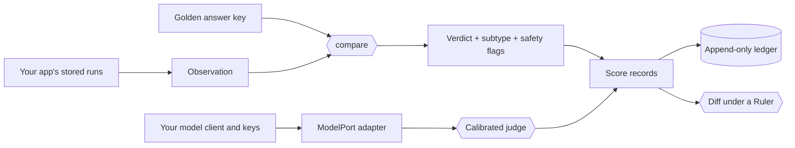

<div align="center">

# 🐤 Canary

**Catch the silent failures before your users do.**

A small, provider-neutral evaluation kernel for LLM apps and agents:
deterministic verdicts, LLM judges that must earn the right to score, and run
diffs that refuse to compare apples with oranges.

No provider SDKs, no network calls, no API keys inside — your judges run
through the model client you already trust.


[Quick start](#quick-start) ·
[Agent skill](#let-your-coding-agent-wire-it-in) ·
[Why evaluation](#why-evaluation-is-the-job-now) ·
[What's inside](#whats-in-the-box) ·
[Compared with similar tools](#comparing-canary-with-similar-projects) ·
[Integration guide](docs/integration.md) ·
[Tutorial](TUTORIAL.md)

</div>

---

## Your demo passed. Your users found the bug.

LLM systems fail in two ways. **Loud failures** — timeouts, stack traces,
refusals — page someone. **Silent failures** don't. The agent returns three
contracts instead of four, ranks the results backwards, cites a record it
never read, or cheerfully runs a query it should have declined. Nothing
crashes. The dashboard stays green. The answer is wrong.

Miners once carried a canary underground because it noticed bad air before
they did. Canary does that job for AI systems. Every evaluation ends in
exactly one verdict — `correct`, `loud_fail`, or `silent_wrong` — and a silent
failure always says *which kind* of wrong it is. Every verdict comes with
receipts: the evidence behind it, the hash of the answer key it was checked
against, and the date it was scored.

## Why evaluation is the job now

Traditional software fails deterministically: the same input breaks the same
way, and one unit test pins the bug down forever. LLM systems don't work like
that. The same prompt can pass on Tuesday and fail on Wednesday. A model
upgrade can fix ten cases and quietly break three. A prompt that reads better
can score worse. When behavior is probabilistic, evaluation stops being a QA
step at the end and becomes the engineering loop itself: the spec you build
against, the regression suite that guards every release, and the early
warning system in production. Teams that ship reliable agents aren't the ones
with the cleverest prompts. They're the ones who can tell, quickly and
honestly, whether a change made things better.

That's why evaluation has become one of the busiest corners of the AI stack.
Observability platforms trace and chart every model call. Metric libraries
ship dozens of ready-made scorers. Test runners red-team prompts in CI.
Benchmark harnesses rank models on public suites. How Canary compares with
them is [laid out below](#comparing-canary-with-similar-projects).

But the hardest questions in evaluation aren't about running *more* evals.
They're about trusting the ones you have:

- **Was that failure loud or silent?** A crash and a confident wrong answer
  are different risks, and a single pass rate hides the difference.
- **Can I trust the judge?** LLM-as-a-judge scales review beautifully, but an
  uncalibrated judge is just another model with opinions.
- **Did the product change, or did the ruler?** When the rubric, the judge
  model, the dataset, or the scoring code moves between runs, "+4%" might
  measure nothing at all.
- **Can I re-score last month's runs?** When the grading rules improve, old
  results should improve with them — without paying for every model call
  again.

Canary is a small, sharp library built around those four questions. It was
extracted from the evaluation code of two production AI products that had
built the same plumbing twice and watched their copies drift apart. Canary
keeps the *method* in one place; each application keeps its *instruments*:
its agents, prompts, data, model access, and storage.

## What's in the box

🎯 **A verdict taxonomy that says *how* it's wrong.** Three verdicts, four
loud-failure subtypes, and ten silent ones — `subset`, `superset`, `overlap`,
`disjoint`, `empty_wrong`, `wrong_value`, `wrong_order`, `ambiguous_shape`,
`field_conformance`, and `unexpected_execution` — plus independent safety
flags for decoy leaks, missing tenant scoping, write attempts, and truncated
results. The taxonomy is closed and versioned: a typo is a validation error,
never a new category.

🔁 **Re-score history for free.** Comparison and scoring are pure functions,
with no network, no database, and no clock. Store observations once, then
re-derive every verdict bit-for-bit whenever the rules improve.

⚖️ **Judges that must earn the right to score.** `ClosedChoiceJudge` and
`FindingsJudge` answer in a closed JSON schema and stay locked until a
calibration report shows they agree with your hand-labelled examples (by
default, 80% agreement over at least five records). Change the prompt, the
choices, or the judge's version — which should name its model — and the
calibration stops applying. A malformed answer gets one repair; a second one
is recorded as unavailable, never as a pass.

📏 **Diffs that refuse to compare apples with oranges.** A `Ruler` records the
grading standard: taxonomy version, judge rubric hashes, calibration IDs,
criteria, and frozen inputs. `diff_scores` sorts cases into improved,
regressed, mixed, unchanged, and incomparable, keeps a label-transition
matrix so "same score, different failure" still shows up, and refuses outright
when the ruler changed.

🧊 **Pre-registered experiments.** Freeze the config, corpus, source hashes,
data revision, and hypotheses *before* the run, the way a careful lab would.

🎲 **Luck versus progress.** A ⌈2n/3⌉ stability bar with sample-size
sensitivity shows when a "win" is really just n.

📒 **An append-only ledger.** Resumable JSONL checkpoints with content-hashed
case identities, so a rerun picks up exactly the cases that haven't passed
under their current inputs. A truncated or corrupted line fails loudly instead
of vanishing.

✅ **Corpus manifests that fail closed.** Every expected case is present and
reviewed, or the corpus does not load.

🧮 **Pure metrics.** Set relations, span IoU and F1, SQL write-verb and
forbidden-value scans, exact and regex text matching, and optional JSON
Schema conformance — all returning one `Score` shape shared by code, model,
and human evaluators.

🔌 **Bring your own model, keep your own keys.** Canary never imports a
provider SDK, opens a socket, or reads an environment variable, and its tests
enforce all three. Judges call a one-method async `ModelPort` wrapped around
the client your app already has. Copyable adapters for the Anthropic and
OpenAI SDKs live in [`examples/`](examples/).

🌱 **Rubric seeds from Arize Phoenix.** Hallucination, tool selection, tool
invocation, tool-response handling, and user friction — attributed, and inert
until you calibrate them on your own data.

🤖 **A skill for your coding agent.** The bundled `canary-evals` skill teaches
Claude Code, Codex, and other agents that read
[Agent Skills](https://agentskills.io) how to wire Canary into your project
safely. [Install it](#let-your-coding-agent-wire-it-in) as a Claude Code
plugin or as a plain skill folder.

## Quick start

Canary installs straight from this repository (the name `canary` on PyPI
belongs to an unrelated project, so never install the bare name):

```bash
uv add "git+https://github.com/skrivov/canary" --tag v0.4.0
```

```bash
pip install "canary @ git+https://github.com/skrivov/canary@v0.4.0"
```

Now catch a silent failure. The agent answered without an error, and its
answer looks plausible — but one contract is missing:

```python
from datetime import date

from canary import IdSetGolden, Observation, compare

# The answer key: which contracts should the agent have returned?
golden = IdSetGolden(id_column="contract_id", ids=("C-100", "C-200", "C-300"))

# What the agent actually returned.
observation = Observation(
    executed=True,
    columns=("contract_id",),
    rows=({"contract_id": "C-100"}, {"contract_id": "C-200"}),
)

verdict = compare(observation, golden, today=date(2026, 9, 1))

print(verdict.verdict)              # silent_wrong
print(verdict.subtype)              # subset
print(verdict.evidence["missing"])  # ['C-300']
print(verdict.metrics)              # precision 1.0, recall 0.67, f1 0.8
```

`today` is a parameter, not a clock read, so the same stored observation always
produces the same verdict — this year or next.

From a clone of this repository, two runnable scripts show the whole flow:

- `python examples/offline_quickstart.py` scores stored runs into an
  append-only ledger. No model, no key.
- `python examples/judge_quickstart.py` calibrates an LLM judge and then lets
  it score. It uses an offline fake model by default; set
  `JUDGE_PROVIDER=anthropic` (with `ANTHROPIC_API_KEY`) or
  `JUDGE_PROVIDER=openai` (with `OPENAI_API_KEY` and `JUDGE_MODEL`) to use a
  real one.

## Let your coding agent wire it in

Canary ships with an agent skill,
[`canary-evals`](skills/canary-evals/SKILL.md), so your coding agent knows the
library before it writes a line. Ask it to add an evaluation, and it will:

- install Canary only from a pinned tag or wheel, never the unrelated PyPI
  package, and check the installed copy with the skill's inspection script;
- find the evaluation code your project already has and extend it, instead of
  building a second stack beside it;
- reach for a deterministic comparison first, and add an LLM judge only when
  rules can't express the criterion — calibrated before it scores;
- prove a migrated evaluator by re-scoring stored runs offline and requiring
  identical verdicts;
- keep API keys out of every Canary record, and ship each new grader with a
  test that watches it fail.

The skill is a plain folder in the open [Agent Skills](https://agentskills.io)
format: instructions, two reference files, and one read-only inspection
script. Install it one of three ways:

| Install | Best for | What you get |
| --- | --- | --- |
| [Claude Code plugin](#claude-code-plugin) | Claude Code users who want the skill everywhere with the least effort | Two commands. The skill from the latest Canary release, pinned to its release tag. Update, disable, or remove it from `/plugin`. |
| [Personal skill folder](#personal-skill-folder) | Codex users, users of Cursor, Gemini CLI, GitHub Copilot, and [other Agent Skills agents](https://agentskills.io/clients), and Claude Code users who prefer plain files | One copy for all your projects, pinned to the tag you choose. It changes only when you reinstall it. |
| [Project skill folder](#project-skill-folder) | Teams | The skill lives in your repository, at the same release as the Canary in your lockfile. Every teammate and every clone gets the same instructions, and upgrades go through code review. |

Pick one per agent: installing two of them loads the skill twice.

### Claude Code plugin

This repository doubles as a Claude Code plugin marketplace. In a Claude Code
session, run:

```text
/plugin marketplace add skrivov/canary
/plugin install canary@canary
```

From a shell, the same two steps are `claude plugin marketplace add
skrivov/canary` and `claude plugin install canary@canary`. Then type
`/canary:canary-evals`, or just describe the task: Claude loads the skill when
the request matches.

After a Canary release, run `claude plugin marketplace update canary` and then
`claude plugin update canary@canary`, or turn on auto-update for the `canary`
marketplace in `/plugin`.

### Personal skill folder

Take the skill from the same tag as the library, so its instructions match the
API you have. For Claude Code:

```bash
mkdir -p ~/.claude/skills
curl -fsSL https://github.com/skrivov/canary/archive/refs/tags/v0.4.0.tar.gz |
  tar -xzf - -C ~/.claude/skills --strip-components=2 canary-0.4.0/skills/canary-evals
```

Then type `/canary-evals`, or just describe the task. For Codex:

```bash
mkdir -p ~/.agents/skills
curl -fsSL https://github.com/skrivov/canary/archive/refs/tags/v0.4.0.tar.gz |
  tar -xzf - -C ~/.agents/skills --strip-components=2 canary-0.4.0/skills/canary-evals
```

Then mention `$canary-evals`, or let Codex pick the skill from your request.
Other agents that read Agent Skills take the same folder in their own skills
directory.

### Project skill folder

From your project's root, use the tag your lockfile pins and commit the
result. Claude Code reads `.claude/skills`; Codex reads `.agents/skills`:

```bash
dir=.claude/skills   # for Codex: dir=.agents/skills
mkdir -p "$dir"
curl -fsSL https://github.com/skrivov/canary/archive/refs/tags/v0.4.0.tar.gz |
  tar -xzf - -C "$dir" --strip-components=2 canary-0.4.0/skills/canary-evals
git add "$dir/canary-evals"
```

To upgrade a folder install, delete `canary-evals` and rerun the command with
the new tag. If an agent that was already running doesn't list the skill,
restart it.

## Judges that earn trust

An LLM judge in Canary cannot score until it has proven itself against your
labels:

```python
from canary.calibration import calibrate
from canary.judge import ClosedChoiceJudge
from canary.model_port import Message

judge = ClosedChoiceJudge(
    port=model_port,                      # wraps your app's own model client
    evaluator_id="support.grounding",
    evaluator_version="1:claude-opus-5",  # name the model: switching it voids calibration
    choices={"grounded": 1.0, "unsupported": 0.0},
    operation="eval.grounding",
    prompt_messages=(Message(role="system", content=grounding_rubric),),
)

report = await calibrate(judge, hand_labelled_records)
if not report.calibrated:
    raise SystemExit(f"judge agrees only {report.aggregate_agreement:.0%} of the time")

score = await judge.with_calibration(report).evaluate(case_messages, case_id="case-17")
```

Before calibration, `judge.evaluate(...)` raises `UncalibratedJudgeError`.
After it, every score carries the calibration ID and rubric hash that licensed
it. The [integration guide](docs/integration.md#4-model-access-and-api-keys)
shows how to wrap your model client, which environment variables each provider
SDK reads, and how to keep keys out of stored results.

## How it fits together



Everything left of the verdicts and judges is yours; everything Canary returns
is plain data for your own storage, dashboards, and CI gates.

## What Canary does in your project

Canary is a library, so it runs wherever your evaluation code already runs: a
pytest suite, a CI job, a benchmark script, or a scheduled worker. These are
the jobs it takes over:

- **Gate releases on answers, not vibes.** Project each agent answer into an
  `Observation`, compare it with its answer key, and fail the build on any
  `silent_wrong`. The verdict names the subtype — missing items, wrong order,
  an execution that should have been a refusal — and carries the evidence.
- **Run benchmarks you can defend.** Freeze the configuration, corpus, and
  source hashes before the run starts. Checkpoint every case in the
  append-only ledger, so a crashed run resumes instead of starting over. Apply
  the ⌈2n/3⌉ stability bar to repeated attempts. Diff the run against its
  baseline only when both were graded by the same ruler.
- **Put an LLM judge into production safely.** Wrap the model client your app
  already uses, calibrate the judge against hand-labelled examples, and let it
  score only after it passes. Start from the bundled hallucination, tool-use,
  and user-friction rubrics, or write your own. Every score records the
  calibration that licensed it.
- **Score production traces in one shape.** Deterministic checks, calibrated
  judges, and human reviews all produce the same `Score` record, with
  idempotent row IDs for your own tables.
- **Change the evaluator without losing history.** Re-score stored runs
  offline through the old and the new implementation and require identical
  verdicts — no model calls, no database, no re-execution. When the rules
  genuinely improve, re-derive every historical verdict under the new ones.
- **Keep golden corpora honest.** A corpus manifest refuses to load when a case
  is missing, a review is incomplete, or a reviewer is a placeholder.

## Comparing Canary with similar projects

Every project in this section evaluates LLM apps and agents with model judges
and code checks, and so does Canary. What differs is shape and focus. The
others are platforms and frameworks that trace your app, run your test suites,
or bring broad catalogs of ready-made metrics. Canary is a small library that
lives inside the code you already have, and it spends its effort on one
question: can you trust the verdict?

### At a glance

| Project | What it is | License | Runs as | Languages |
| --- | --- | --- | --- | --- |
| **Canary** | Evaluation kernel for LLM apps and agents | MIT | A library inside your code; no server | Python |
| [Arize Phoenix](https://github.com/Arize-ai/phoenix) | AI observability and evaluation platform | Elastic License 2.0; client libraries Apache-2.0 | Server with a web UI, self-hosted or cloud; its eval library also runs alone | Python, TypeScript |
| [Langfuse](https://github.com/langfuse/langfuse) | LLM engineering platform for tracing and evaluation | MIT; enterprise features commercial | Server with a web UI, self-hosted or cloud, plus SDKs | Python, TypeScript |
| [DeepEval](https://github.com/confident-ai/deepeval) | LLM evaluation framework | Apache-2.0 | Library and CLI; optional hosted platform, Confident AI | Python, TypeScript |
| [Ragas](https://github.com/vibrantlabsai/ragas) | Toolkit for evaluating and optimizing LLM apps | Apache-2.0 | Library and CLI | Python |
| [promptfoo](https://github.com/promptfoo/promptfoo) | CLI and library for evaluating and red-teaming LLM apps | MIT | CLI with a local web viewer; paid enterprise edition | TypeScript, with Python hooks |
| [Inspect](https://github.com/UKGovernmentBEIS/inspect_ai) | Framework for frontier AI evaluations, from the UK AI Security Institute | MIT | Library and CLI with a local log viewer | Python |

### Feature by feature

✅ built in · — not built in · a word or two: partly there, a recipe you build
yourself, or only in a hosted, beta, or companion product

| | Canary | Phoenix | Langfuse | DeepEval | Ragas | promptfoo | Inspect |
| --- | :-: | :-: | :-: | :-: | :-: | :-: | :-: |
| **Scoring** | | | | | | | |
| LLM-as-a-judge | ✅ | ✅ | ✅ | ✅ | ✅ | ✅ | ✅ |
| Code checks | ✅ | ✅ | ✅ | ✅ | ✅ | ✅ | ✅ |
| Ready-made scorers | 6 metrics, 5 rubrics | 16 | ~24 | 50+ | ~30 | ~60 | 12 |
| Answer keys for result sets, totals, and rankings | ✅ | — | — | — | SQL and ID sets | — | — |
| Typed failure taxonomy | ✅ | — | — | — | — | factuality only | partial |
| **Trusting the judge** | | | | | | | |
| Measures judge agreement with human labels | ✅ | cookbook | ✅ beta | hosted | partial | manual | partial |
| Judge must pass calibration before it scores | ✅ | — | — | — | — | — | — |
| **Trusting the comparison** | | | | | | | |
| Re-scores stored outputs without rerunning the app | ✅ | ✅ | ✅ | ✅ | ✅ | partial | ✅ |
| Compares runs case by case | ✅ | ✅ | ✅ | hosted | totals only | ✅ | via dataframes |
| Refuses to compare runs graded differently | ✅ | — | — | hosted | — | dataset only | — |
| Pre-registers a run: config, data, and code hashes frozen first | ✅ | — | — | — | — | — | — |
| Separates luck from progress over repeated trials | ✅ | repeats only | — | repeats only | — | repeats only | ✅ |
| **Beyond scoring** | | | | | | | |
| Tracing and dashboards | — | ✅ | ✅ | hosted | — | local viewer | local viewer |
| Human annotation UI | — | ✅ | ✅ | hosted | — | partial | partial |
| Red teaming | — | — | — | add-on | — | ✅ | static suites |
| Public benchmarks | — | — | — | ✅ | — | partial | ✅ |
| Synthetic test data | — | — | — | ✅ | ✅ | beta | — |
| **Footprint** | | | | | | | |
| No telemetry by default | ✅ | opt-out | opt-out | opt-out | opt-out | opt-out | ✅ |
| Agent skill or MCP server | ✅ | ✅ | ✅ | ✅ | — | ✅ | companion |

### Where Canary stands out

- **Every failure has a name.** Canary sorts each result into `correct`,
  `loud_fail`, or `silent_wrong`, with fourteen closed subtypes and separate
  safety flags. It checks returned sets, totals, and rankings against answer
  keys and scores sets by precision, recall, and F1. Elsewhere a failure is
  usually a low score or a `false`; promptfoo's factuality grader and Inspect's
  score reasons come closest.
- **A judge has to earn its vote.** Langfuse and DeepEval's hosted platform
  measure how often a judge agrees with human labels. Canary is the only
  project here where a judge cannot score at all until it passes that test.
- **Diffs that know when they mean nothing.** Canary refuses to diff two runs
  when the judge, rubric, taxonomy, or frozen inputs changed between them.
  promptfoo checks that the test set matches, and DeepEval's hosted experiments
  check the dataset and metric collection; the rest leave it to you.
- **Experiments you can defend.** Freezes record the config, corpus, and source
  hashes before a run starts, and a ⌈2n/3⌉ stability bar separates luck from
  progress. Inspect is the only other project here with built-in
  repeated-trial statistics.
- **Nothing to deploy, nothing phoning home.** One runtime dependency
  (Pydantic), no server, and no telemetry. The test suite enforces that the
  library makes no network calls and reads no API keys.

### Where others go further

- **Observability and review.** Phoenix and Langfuse trace every call, chart
  it, and give reviewers an annotation UI. Langfuse adds annotation queues and
  scores live production traffic.
- **Metric breadth.** promptfoo (about 60), DeepEval (50+), and Ragas (about
  30) ship ready-made metrics for RAG, agents, conversations, and safety.
- **Red teaming.** promptfoo generates attacks across 150+ plugins, and
  DeepEval's companion DeepTeam covers dozens of vulnerabilities.
- **Benchmarks and sandboxes.** Inspect runs hundreds of public benchmarks and
  sandboxed agent evaluations; DeepEval bundles MMLU, GSM8K, HumanEval, and
  more.
- **Test data.** Ragas and DeepEval synthesize test sets from your documents.
- **Other languages.** Phoenix, Langfuse, DeepEval, and promptfoo also work
  from TypeScript.

### Also in this space

Open source: [OpenAI Evals](https://github.com/openai/evals),
[lm-evaluation-harness](https://github.com/EleutherAI/lm-evaluation-harness),
[HELM](https://github.com/stanford-crfm/helm),
[TruLens](https://github.com/truera/trulens),
[Opik](https://github.com/comet-ml/opik),
[MLflow](https://github.com/mlflow/mlflow),
[W&B Weave](https://github.com/wandb/weave),
[autoevals](https://github.com/braintrustdata/autoevals),
[OpenEvals](https://github.com/langchain-ai/openevals), and
[Giskard](https://github.com/Giskard-AI/giskard-oss). Hosted:
[LangSmith](https://www.langchain.com/langsmith) and
[Braintrust](https://www.braintrust.dev).

Compared on 2026-09-25 against Phoenix 20.16.0, Langfuse 4.45.4, DeepEval
4.2.6, Ragas 0.4.3, promptfoo 0.123.1, and Inspect 0.3.268, from each
project's documentation and source code. These projects move fast. If a cell
is out of date, please [open an issue](https://github.com/skrivov/canary/issues).

## What Canary is not

Honest limits, so you can choose well:

- **Not an observability platform.** No tracing, no UI, no hosted service.
  The comparison above shows which projects provide them.
- **Not a benchmark or dataset hub.** You bring the cases and answer keys.
- **Not a red-teaming tool.** It grades behavior; it doesn't generate attacks.
- **Not batteries-included for every metric.** There's no embedding
  similarity yet, and no built-in concurrency or rate limiting: your
  `ModelPort` decides how hard to hit the provider.
- **Not on PyPI.** Install from this repository or a release wheel.
- **Young.** 0.4 is the first public release. The API may change before 1.0,
  and every change ships in the [changelog](CHANGELOG.md) with its migration.

## Rules of the road

- Keep provider SDKs, networking, and environment lookups out of Canary.
  Model access goes through `ModelPort`.
- Never put credentials into Canary records. Messages, judge inputs,
  calibration records, ledger payloads, score evidence, and freeze
  configuration are all meant to be stored and shared.
- `score=None` means "not scoreable." It is never zero.
- Pass clocks and source contents in explicitly; scoring never reads ambient
  state.
- `canary.ledger` is the only writer. Everything else returns data for your
  application to persist.
- Attach a passing `CalibrationReport` before a judge scores in production.
- Diff only scores measured under matching, artifact-recorded rulers.
- Watch every evaluator fail: each comparator, grader, and metric ships with a
  test built to make it fail.

## Documentation

- [Tutorial](TUTORIAL.md) — every surface, end to end, starting from the
  plain-language [evaluation nomenclature](TUTORIAL.md#evaluation-nomenclature).
- [Integration guide](docs/integration.md) — installing into an existing
  environment, model adapters, and API keys.
- [Examples](examples/) — runnable quickstarts and provider adapters.
- [Agent skill](skills/canary-evals/SKILL.md) — the `canary-evals` skill for
  coding agents, with its API reference and workflows.
- [Design](docs/design.md) — the invariants and why they exist.
- [Changelog](CHANGELOG.md) — releases and migrations.
- [Security policy](SECURITY.md) — reporting vulnerabilities and handling
  secrets.

## Develop Canary

```bash
uv sync --extra schema
.venv/bin/python -m pytest -q
scripts/release.sh
```

`scripts/release.sh` runs the suite, builds the wheel and sdist into `dist/`,
and prints the wheel's SHA-256. Given an application directory, it also copies
the wheel into that directory's `vendor/` folder and prints the source stanza
to add there.

## Questions, bugs, and security reports

All communication about Canary happens in this repository. Open an
[issue](https://github.com/skrivov/canary/issues) for questions, bugs, and
feature requests. Report vulnerabilities privately as described in
[SECURITY.md](SECURITY.md) — never in a public issue.

## Acknowledgments

Canary's score `direction` field and its closed-choice judges follow the
design of [Arize Phoenix](https://github.com/Arize-ai/phoenix)'s evaluators,
and its five rubric seeds are adapted from Phoenix's judge templates.

## License

Canary's own code is released under the [MIT License](LICENSE).

The five rubric seeds in `src/canary/rubrics/*.json` are modified copies of
Arize Phoenix rubric texts and remain under the Elastic License 2.0; see
[THIRD_PARTY_NOTICES.md](THIRD_PARTY_NOTICES.md). If ELv2 terms don't suit
your use, leave the seeds unused. Everything else in Canary works without
them.
